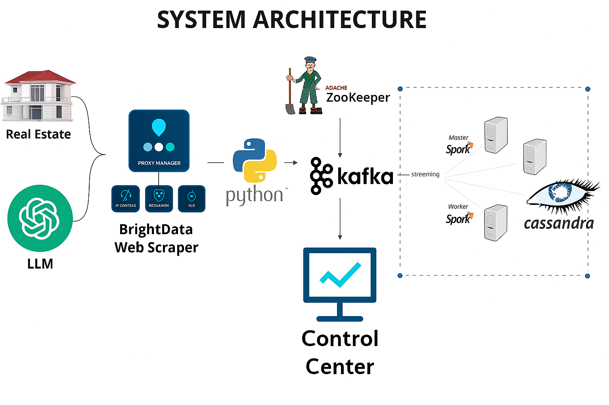

# Real Estate Streaming Pipeline

This project is a complete real-time data streaming pipeline that scrapes UK property listings, processes them using Kafka and Spark, and stores them in Cassandra for downstream analytics. I built this to practice working with a modern data stack and simulate what real-time pipelines look like in production.

---

## Technologies Used

- **Python** – for scraping and logic  
- **Apache Kafka** – for message brokering and streaming  
- **Apache Spark (Structured Streaming)** – for real-time processing  
- **Apache Cassandra** – as the final data sink  
- **Docker Compose** – to manage multi-container setup  
- **Playwright** – for web scraping  
- **Pandas** – for parsing and formatting JSON  
- **Spark Cassandra Connector** – to connect Spark with Cassandra  
- **Kafka Control Center** – for visualizing the topic stream  

---

## Project Architecture

Here's a visual of the pipeline and system architecture:



---

### Breakdown

- **Scraping**: Playwright fetches real estate listings from Zoopla as JSON and pushes them to Kafka  
- **Kafka Broker**: Stores each scraped listing as a message in the `properties` topic  
- **Spark Consumer**: Listens to the Kafka topic, transforms and parses the messages, then writes to Cassandra  
- **Cassandra**: Stores all listings in a table under `property_streams.properties`  

## File Structure

```
RealEstate_Streaming_Pipeline/
│
├── docker-compose.yaml            # Spins up all containers (Kafka, Cassandra, Spark, etc.)
├── Dockerfile                     # Container setup for Spark
├── listings.json                  # Sample scraped data from Zoopla
│
├── jobs/
│   ├── main.py                    # Scraper that sends property data to Kafka
│   ├── spark-consumer.py          # Spark Structured Streaming job to read from Kafka and write to Cassandra
│   ├── helpers.py                 # Helper functions for data extraction and transformation
│
├── system_architecture.png        # System architecture diagram
├── kafka_data.png                 # Kafka Control Center screenshot
├── cassandra_data.png             # Screenshot of data stored in Cassandra
├── README.md                      # This file
```

---

## How the Pipeline Works

### 1. Run the full stack  
Start all services using Docker Compose:

```bash
docker compose up -d --build
```

### 2. Scrape listings  
Once containers are up, run the scraper which fetches listings and sends them to Kafka:

```bash
python3 jobs/main.py
```

### 3. Start the Spark job  
This will consume from Kafka and insert into Cassandra:

```bash
spark-submit \
  --packages com.datastax.spark:spark-cassandra-connector_2.12:3.4.1,org.apache.spark:spark-sql-kafka-0-10_2.12:3.4.1 \
  jobs/spark-consumer.py
```

### 4. Verify Data in Kafka  
Visit [localhost:9021](http://localhost:9021) to inspect the Kafka topic in the Confluent Control Center.

### 5. Check Cassandra  
Use the `cqlsh` CLI inside the Cassandra container to check the `properties` table:

```bash
docker exec -it cassandra cqlsh
```

Then run:

```sql
USE property_streams;
SELECT * FROM properties LIMIT 3;
```

---

## **Key Features**

- Works entirely in real time using a microservice-based design  
- Clean web scraping using Playwright  
- Resilient Kafka topic with backpressure handling  
- Spark Structured Streaming for fault-tolerant ETL  
- Writes directly to Cassandra for scalable storage  
- Includes visual validation via Kafka Control Center and screenshots  

---

## **Why I Built This**

I wanted to get hands-on experience building a production-like streaming system using tools I would use in a real data engineering job. This helped me understand how everything connects: from raw scraping to ingestion to transformation and finally storage.

This was also a good way to improve my comfort with Kafka, Spark streaming, Docker networking, and writing clean, modular Python code.

---

## **Future Improvements**

- Build a real-time dashboard in Streamlit or Grafana to show incoming listings  
- Include unit and integration tests  
- Deploy to the cloud using AWS MSK and EC2  

---

## Author

**Jasjot Parmar**  
Aspiring Data Engineer | Python & SQL Enthusiast | Curious Storyteller  

🔗 [GitHub](https://github.com/jasjotp) • [LinkedIn](https://www.linkedin.com/in/jasjotparmar)

